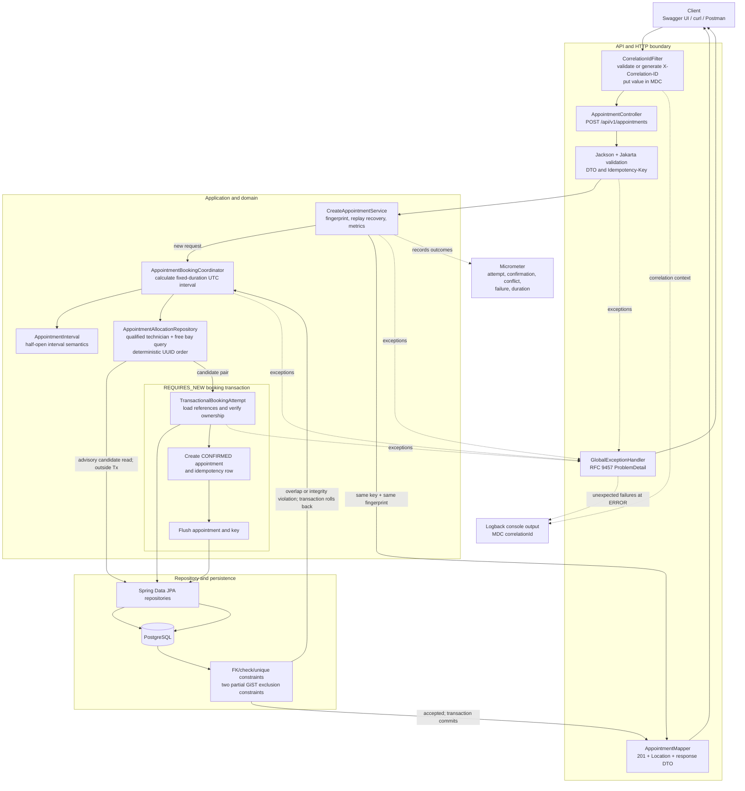

# Unified Service Scheduler — System Design

## 1. Overview

The Unified Service Scheduler is the Scenario A backend for creating, retrieving, and listing dealership service appointments while automatically assigning an active, qualified technician and an active service bay. It implements the booking, validation, idempotency, persistence, and concurrent double-booking requirements as a modular Spring Boot monolith; a production frontend is deliberately out of scope, so the client journey is demonstrated through OpenAPI/Swagger UI, `curl`, and the Postman suite.

## 2. Architecture Diagram



The candidate query is intentionally shown outside the transaction. It improves allocation and produces a useful no-capacity result, but it is not the concurrency guarantee. The authoritative revalidation happens when PostgreSQL evaluates the exclusion constraints during the transactional flush.

## 3. Component Descriptions

### API layer

`AppointmentController` owns the HTTP contract for create, get, and paginated list operations, while `AvailabilityController` exposes an explicitly advisory preview. Java records such as `CreateAppointmentRequest` and `AppointmentResponse` separate the public representation from JPA entities; Jackson parses offset timestamps, Jakarta validation rejects missing values, and `AppointmentMapper` builds stable resource references. The layer's single responsibility is translating HTTP input and output—not deciding allocation or persistence rules.

### Domain and service layer

`CreateAppointmentService` coordinates request fingerprinting, idempotent replay recovery, metrics, and high-level failure translation. `AppointmentBookingCoordinator` loads the service duration, creates the requested `AppointmentInterval`, asks for deterministic candidate pairs, and bounds alternative-pair attempts to three. `TransactionalBookingAttempt` owns the atomic state change. `AppointmentInterval` expresses the core `[start, end)` time rule using `Instant`; the service layer's responsibility is to enforce the booking use case without exposing HTTP or schema details.

### Repository layer

Spring Data JPA repositories provide reference lookup and appointment persistence. The technician and bay repositories contain the important eligibility predicates: correct dealership, active resource, required qualification for technicians, no overlapping `CONFIRMED` appointment, and stable UUID ordering. The repository layer's responsibility is translating domain-oriented queries and writes into persistence operations; its availability result remains advisory because another transaction can act after the read.

### Persistence

PostgreSQL 17 stores reference data, appointments, and idempotency records. Flyway migrations enable `btree_gist`, create the relational schema and indexes, enforce vehicle ownership and resource/dealership consistency with composite foreign keys, and install separate technician and bay overlap constraints. Hibernate runs with `ddl-auto=validate`, so Flyway—not ORM auto-DDL—is the schema authority. Persistence has one responsibility: durably preserve associations and enforce invariants for every writer, including concurrent or future application instances.

## 4. Data Flow

1. **HTTP boundary and validation.** `CorrelationIdFilter` accepts a safe `X-Correlation-ID` or generates a UUID, adds it to MDC and the response, then passes the request to Spring MVC. Jackson deserializes `CreateAppointmentRequest`; `@NotNull` fields and the 8–128 character `Idempotency-Key` header are validated. Malformed JSON, wrong types, missing values, or a missing/invalid header become `400 INVALID_REQUEST`. No write transaction has started.

2. **Idempotency check.** `CreateAppointmentService` calculates a SHA-256 fingerprint from customer, vehicle, dealership, service type, and normalized start instant. `IdempotencyRecoveryService` reads the key in a separate read-only `REQUIRES_NEW` transaction. A matching key/fingerprint returns the original appointment as `201` without another write; a reused key with a different fingerprint returns `400 IDEMPOTENCY_KEY_REUSED`.

3. **Interval and candidate availability.** The non-transactional coordinator loads the service type or returns `404 RESOURCE_NOT_FOUND`, derives `endTime` from its positive fixed duration, then queries eligible technicians and bays. The technician query checks dealership, active status, required qualification, and overlap; the bay query checks dealership, active status, and overlap. Both use `existing.start < requested.end AND existing.end > requested.start`, so endpoint-touching bookings are allowed. No candidates produces `409 BOOKING_CONFLICT` and no database state is written.

4. **Transaction begins.** The transaction starts when the Spring proxy enters `TransactionalBookingAttempt.attempt()`, annotated `REQUIRES_NEW`. Inside it, repositories load the customer, vehicle, dealership, service type, selected technician, and selected bay. The vehicle/customer relationship is checked explicitly. Unknown customer, vehicle, dealership, or service type is represented as `404 RESOURCE_NOT_FOUND`; a vehicle owned by another customer is `400 INVALID_REQUEST`. The selected technician and bay are also reloaded by ID, although their bare `orElseThrow()` currently turns the unlikely case of either disappearing after candidate selection into the sanitized `500` path. One further implementation nuance is that candidate allocation precedes the dealership lookup, so a nonexistent dealership normally yields no candidates and currently surfaces as `409 BOOKING_CONFLICT` before this loader is reached.

5. **Atomic write and authoritative conflict check.** The service creates one `CONFIRMED` appointment and its idempotency row, then flushes both. PostgreSQL checks foreign keys, uniqueness, interval checks, and the technician/bay exclusion constraints at this point. If the flush succeeds, the transaction commits as the proxied method returns; only then does the controller map the committed view to `201 Created` with `Location`.

6. **Race and failure paths.** A recognized overlap violation rolls back the complete attempt. The coordinator may exclude that candidate pair and try another pair in a fresh transaction, up to three attempts; exhaustion returns `409 BOOKING_CONFLICT`. A residual data-integrity or concurrency race is recovered as an idempotent replay when possible, otherwise returned as `409 BOOKING_RACE_LOST`. Unexpected exceptions become a sanitized `500 INTERNAL_ERROR`. Because the appointment and idempotency row share one transaction, every failed attempt leaves neither an appointment nor an orphaned key or partial assignment.

`GlobalExceptionHandler` renders all expected failures as `application/problem+json` with a stable code, status, detail, request path, timestamp, and correlation ID. It deliberately avoids leaking SQL, constraint names, or customer data.

| Failure point | HTTP outcome | Persisted state |
| --- | --- | --- |
| JSON/header/DTO validation | `400 INVALID_REQUEST` | No write transaction; no rows |
| Unknown service before allocation | `404 RESOURCE_NOT_FOUND` | No write transaction; no rows |
| No eligible candidate | `409 BOOKING_CONFLICT` | No write transaction; no rows |
| Reference or ownership failure inside the attempt | `404 RESOURCE_NOT_FOUND` or `400 INVALID_REQUEST` | Transaction rolled back; no appointment or key |
| Exclusion-constraint race | `409 BOOKING_CONFLICT` after alternatives are exhausted, or `409 BOOKING_RACE_LOST` for a residual race | Failed attempt rolled back; no losing appointment or key |
| Same idempotency key and payload | Original `201` replayed | Original rows retained; no duplicate |
| Same key with a different payload | `400 IDEMPOTENCY_KEY_REUSED` | Original rows retained; no new rows |
| Unexpected operational error | `500 INTERNAL_ERROR` | Active attempt rolled back; response is sanitized |

## 5. Technology Choices, With Justification

- **Java 21 and Spring Boot 3.5.3.** The implementation uses Java 21 LTS—not Java 17—and a conventional Spring MVC stack. This provides records, modern JVM support, mature validation/transaction integrations, and a familiar assessment surface without adding a reactive model that the workload does not require.

- **PostgreSQL 17.** PostgreSQL was chosen over an interchangeable relational database because native `tstzrange`, GiST, partial exclusion constraints, and `timestamptz` directly model the scheduling invariant. The database can therefore prevent overlap across threads, processes, and application instances.

- **Flyway.** Versioned SQL keeps extensions, indexes, composite foreign keys, and PostgreSQL-specific exclusion constraints explicit and reviewable. Hibernate only validates the result, avoiding environment-dependent schema generation and preserving Flyway as the single schema authority.

- **Testcontainers.** Integration and concurrency tests run against real PostgreSQL rather than H2 or mocked repositories. This is necessary because an in-memory substitute cannot faithfully prove GiST exclusion behavior, Flyway compatibility, transaction rollback, or a genuine two-request race.

- **springdoc-openapi.** springdoc derives an interactive OpenAPI surface from the implemented Spring MVC contract, keeping controller behavior and demo documentation close together. It supplies Swagger UI for the assessment without building an otherwise out-of-scope frontend.

- **Docker Compose.** Compose starts the application and PostgreSQL with health checks, local configuration, a development-only Flyway seed, and one reproducible command. It is intentionally sufficient for local assessment and demonstration; orchestration infrastructure would add no value to Scenario A.

These choices follow the constitution's priorities: correctness before convenience, a simple modular monolith, real-database verification, explicit API/data integrity, and reproducible delivery.

## 6. Concurrency Strategy

### Chosen mechanism: PostgreSQL exclusion constraints

The final safeguard is two partial GiST exclusion constraints created by Flyway:

```sql
EXCLUDE USING gist (
  technician_id WITH =,
  tstzrange(start_time, end_time, '[)') WITH &&
) WHERE (status = 'CONFIRMED');
```

The second constraint has the same shape for `service_bay_id`. Together they forbid two confirmed rows that use the same technician or bay over any positive-duration overlap while allowing back-to-back intervals. The constraints are database invariants, so they cover every writer and every application instance rather than only requests that follow one Java code path.

The race being prevented is classic check-then-act: request A and request B can both query at nearly the same time, both observe the final technician and bay as free, and both choose the same pair before either appointment is visible to the other. Their reads are both valid snapshots. At flush, PostgreSQL accepts at most one overlapping confirmed row; the loser is rolled back and translated to a conflict. The application query improves selection, but correctness does not depend on the read remaining current.

### Rejected alternatives

- **Naive application check then save.** This is simple and works in single-threaded demonstrations, but there is an unavoidable window between the availability read and insert. Transaction boundaries alone do not close that window at the default isolation level, especially across multiple application instances.

- **Optimistic locking with retry.** No `@Version` field is present. Optimistic locking can work if contention is represented by a shared, versioned resource/calendar row, but it requires bounded retry and backoff, adds user-visible latency under contention, and still needs careful modeling because the conflicting appointment row does not exist when availability is first checked. It is a reasonable design to reassess if measured contention justifies the extra machinery, not a requirement at this scale.

- **Pessimistic locking.** Locking existing appointment rows does not lock the absence of an overlap. Making it correct would require locking technician and bay rows in a consistent order, which is coarser, reduces unrelated scheduling concurrency, and adds deadlock/timeout behavior to resource selection. The implemented exclusion constraints express the temporal rule more directly.

- **Serializable isolation.** Serializable transactions could detect the anomaly, but they produce broader serialization failures and require generalized retry handling. They communicate the scheduling invariant less clearly than named technician and bay constraints.

Exclusion constraints are a strong fit here because the rule is relational and temporal: a confirmed resource allocation must not overlap another allocation for the same resource. PostgreSQL can evaluate that rule atomically at the only point that matters—the write—while the application remains free to select alternatives and return domain-specific `409` outcomes.

## 7. Observability Strategy

Every request carries a correlation ID through `CorrelationIdFilter`. Safe caller values are preserved; otherwise a UUID is generated. The value is returned in `X-Correlation-ID`, stored in MDC for the duration of the request, printed by the Logback console pattern, and included in error responses.

Micrometer actively records `booking.attempts`, `booking.confirmations`, `booking.conflicts`, `booking.failures`, and `booking.duration`. Actuator exposes health, liveness, readiness, info, metrics, and Prometheus output through the configured management endpoints.

The current logging implementation needs to be described precisely: `GlobalExceptionHandler` logs unexpected failures at `ERROR` with request path and exception class/stack trace. `BookingAuditLogger` defines privacy-safe `INFO` confirmed, `WARN` conflict, and `ERROR` failure messages, but it is not injected into the booking flow, so those accept/reject outcome logs are not currently emitted; outcome visibility currently comes from metrics and HTTP responses. No log statement includes customer display data.

If this later became multi-service, trace context would attach at the correlation filter/controller boundary, propagate through service and repository spans, and annotate database calls. Distributed tracing is not implemented because there is only one service and no remote call chain.

## 8. GenAI Usage in the Design Phase

I used AI as a design and review partner, not as the owner of the architecture. Through Spec Kit, I used it to help structure the constitution, feature specification, implementation plan, research notes, data model, task breakdown, and consistency checks. The useful design work was comparative: making UTC and `[start, end)` semantics explicit, tracing the atomic booking boundary, and discussing application-only checks, pessimistic locking, serializable transactions, and PostgreSQL exclusion constraints. I then verified the important claims against migrations, transaction annotations, repository predicates, and real PostgreSQL concurrency tests rather than accepting generated prose or passing tests at face value.

I also pushed back on unnecessary complexity. I initially considered adding a transactional outbox to showcase Kafka and Debezium experience. That would have solved a problem this system does not have: Scenario A has no external event consumer, and the modular monolith already commits the appointment and idempotency record atomically in PostgreSQL. An outbox would have introduced another table, publication lifecycle, relay/CDC operations, consumer idempotency, and failure modes without enabling an in-scope requirement. I therefore rejected it and kept messaging out of the implementation. The decision was not that outbox is a bad pattern; it was that using it here would be architecture theatre rather than requirement-driven design.

The human-review standard was especially important for concurrency and failure behavior. AI output helped enumerate cases, but I retained responsibility for checking the exclusion definitions, confirming the actual `REQUIRES_NEW` boundary, verifying rollback leaves both appointment and idempotency tables clean, and correcting documentation when it overstated what the code logs or validates.

## 9. Future Evolution (Production Considerations)

- **Cached availability reads.** If advisory availability traffic becomes dominant, Redis could cache computed windows or resource calendars with short TTLs and invalidation after committed appointment/reference-data changes. The cache must never authorize a booking: `POST /appointments` should continue to use PostgreSQL and its constraints as the source of truth.

- **Conditional event integration.** A transactional outbox plus Debezium CDC into Kafka becomes justified only when a real external consumer appears—for example notifications, a technician application, or an operational dashboard. At that point the outbox would atomically couple appointment state with an event record and support reliable asynchronous publication; until then it remains intentionally absent.

- **Read/write scaling.** Listing and advisory availability queries could move to read replicas if replica lag is acceptable to those read experiences. The booking candidate query and all writes should stay on the primary: stale availability is tolerable only as a preview, while the write path requires the primary's current constraints and commit ordering.

- **Higher contention.** First use the existing counters and duration timer to identify dealerships, resources, and windows under contention. If bounded alternative-pair retries become insufficient, introduce jittered backoff and consider versioned resource-calendar rows with optimistic locking, or carefully ordered pessimistic resource locks for hot resources. Any change should retain the exclusion constraints as the final integrity safeguard unless an equally strong database invariant replaces them.
